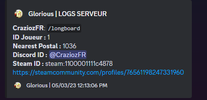

# 📡 Logs général

Vous pourrez ajouter vos Logs que ce soit pour les coups de feu / Personne qui rejoignent votre serveur ou qui quittent.\
\
Vous avez juste à ajouter vos webhooks dans vos salons. \
\
Vous les retrouverez à cet endroit :\
[https://github.com/Crazioz/BaseCraziozV1/blob/main/%5B1.Main%5D/KLogs/config.lua](https://github.com/Crazioz/BaseCraziozV1/blob/main/\[1.Main]/KLogs/config.lua)\
\
Exemple de logs quand vous écrivez dans le Tchat :

<figure><figcaption></figcaption></figure>
