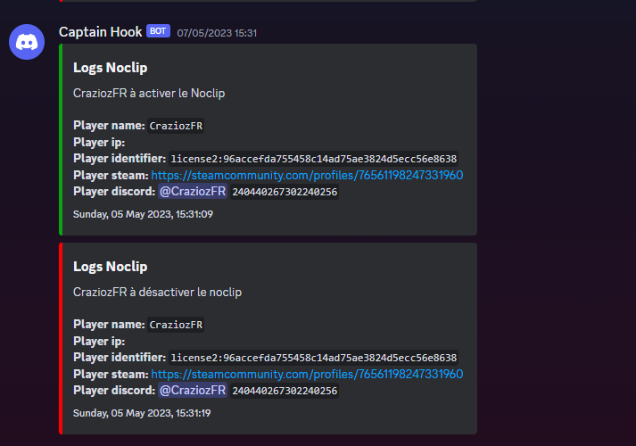

# 🛡 Logs Menu Admin

Vous pourrez ajouter vos Logs que ce soit pour les le give d'argent / SetJob / SetFaction etc...\
\
Vous avez juste à ajouter vos webhooks dans vos salons. \
\
Vous les retrouverez à cet endroit :\
[https://github.com/Crazioz/BaseCraziozV1/blob/main/%5B3.NonESX%5D/%5Bmenu%20admin%5D/Boost-Logs/server\_config.lua](https://github.com/Crazioz/BaseCraziozV1/blob/main/\[3.NonESX]/\[menu%20admin]/Boost-Logs/server\_config.lua)\
\
Exemple de Logs du menu admin :&#x20;

<figure><figcaption></figcaption></figure>
