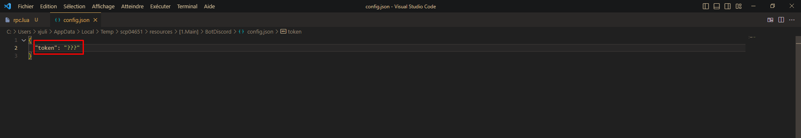
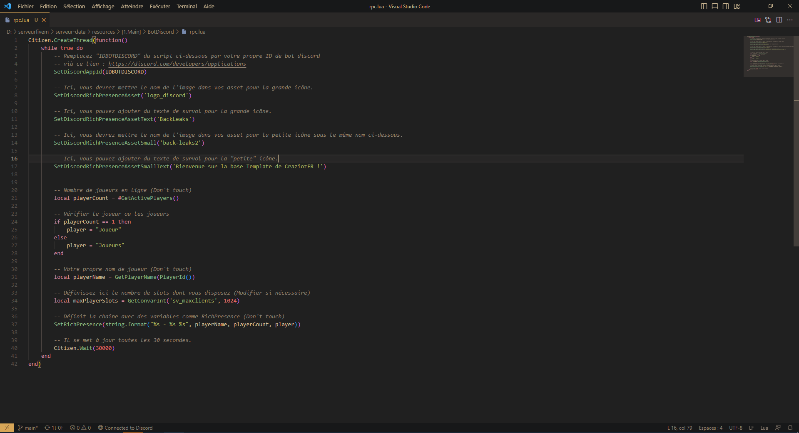

# 🤖 Bot & RichPresence

Pour faire fonctionner votre bot il vous suffit de modifier depuis le fichier Config.json le token de votre bot que vous pouvez retrouver ici :&#x20;

<figure><figcaption>
Lien pour récupérer le token : <a href="https://discord.com/developers/applications">https://discord.com/developers/applications</a>
</figcaption></figure>

Pour modifier le R[ichpresence ](#user-content-fn-1)[^1]il vous suffit de modifier depuis le fichier rpc.lua

Tout d'abord, n'oubliez pas de modifier l'id de l'application discord que vous pouvez faire ici : [https://discord.com/developers/applications](https://discord.com/developers/applications)\
Après avoir fait cela il vous reste plus que modifier le reste à votre guise

<figure><figcaption></figcaption></figure>

[^1]: (sur le profil discord quand vous êtes en jeu)
